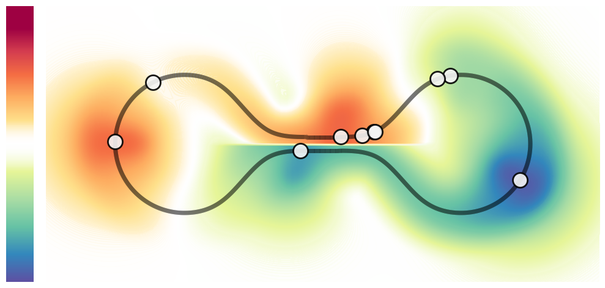
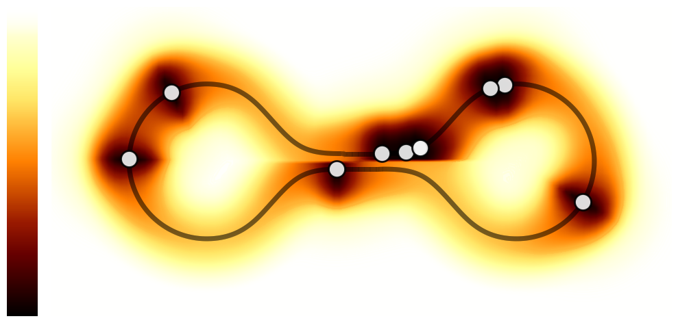

# Implicit Manifold Gaussian Process Regression
Repository containing the code for [Implicit Manifold Gaussian Process](https://arxiv.org/abs/2310.19390).

<p align="center">
  
  
</p>   

### Authors/Maintainers
- Bernardo Fichera (bernardo.fichera@epfl.ch)
- Viacheslav Borovitskiy (viacheslav.borovitskiy@gmail.com)

### Installation
In order to install the package in `.local` run
```sh
pip(pip3) install .
```
For local installation in the current directory
```sh
pip(pip3) install -e .
```
